# School_District_Analysis
School district score analysis using pandas and Jupyter notebook
## Overview of the school district analysis
To perform analyst of math and reading test score accross the school district excluding 9th grader data from Thomas High School due to possible academic dishonesty.
## Results
### 1. How is the district summary affected?
    The district summary has a slightly lower scores and passing % due to the removal of the 9th grader data from Thoams High School.
    
  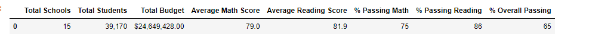
  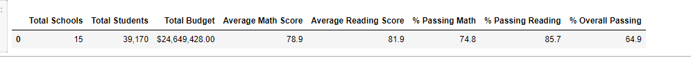

    
### 2. How is the school summary affected?    
    The only part of the school summary that is changed from the original run to the scrubbed version with the removal of the Thomas High School 9th Grade data is the average score and the % of passing students with each category being significatly lower.
   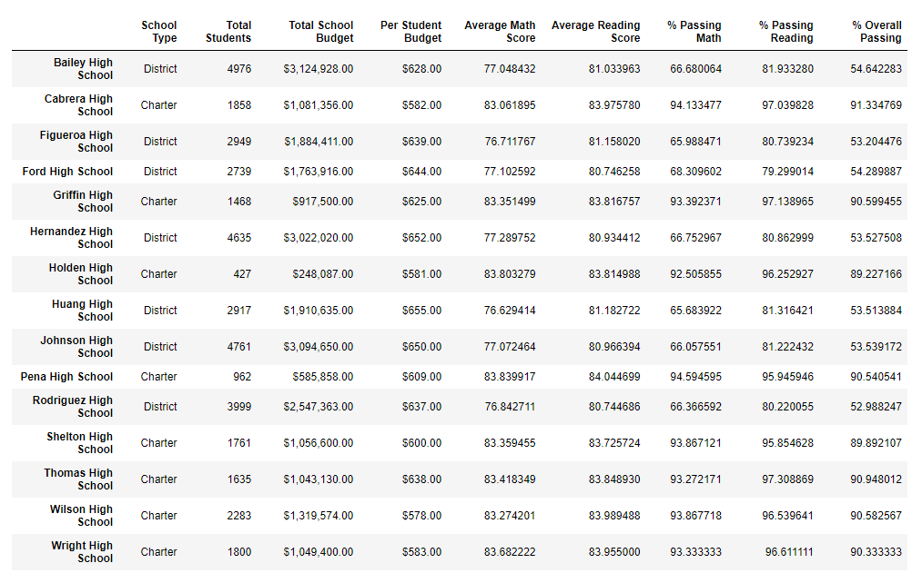
   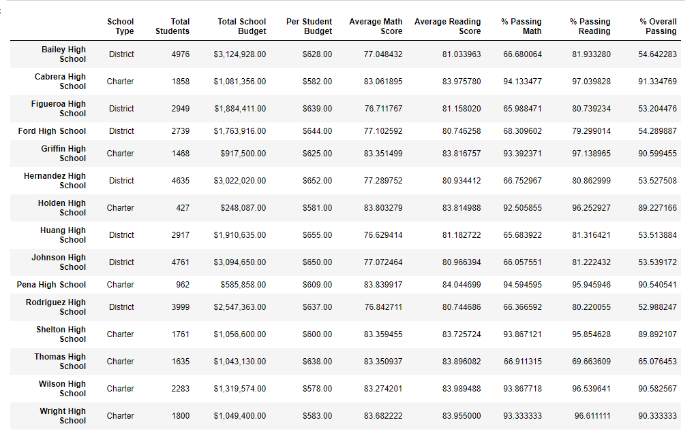    
    
### 3. How does replacing the ninth graders’ math and reading scores affect Thomas High School’s performance relative to the other schools?
    When we replace the 9th grade data with NaN we have to recalculate the average scores and the % of the passing students to only use 10th-12th grade.  Once we calculate the updated average math and reading scores and teh % of those passing math, reading and both using the modifed student count the data is slightly higher then the using the orginal data and is on the higher end of the scores.
   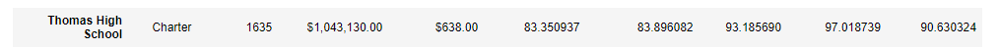
   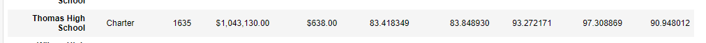  

### 4. How does replacing the ninth-grade scores affect the following:

####      a. Math and reading scores by grade
                The affect of the using the scrubbed data is that only the 9th grade Thomas Highschool cell is now NaN
   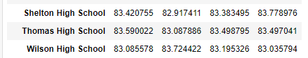
   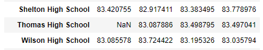  
      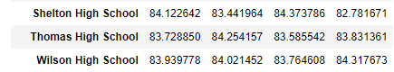
   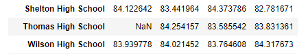  

####      b. Scores by school spending
              There is a fractional change to the $631-645 bucket of data however after we apply the formating to the dataframe it will be unnotiable.
   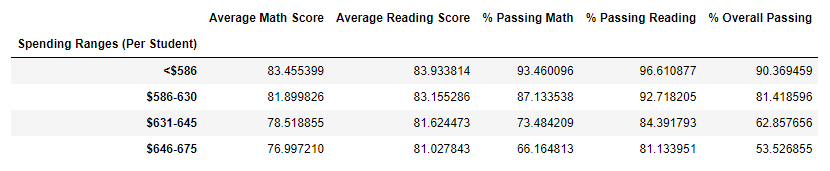
   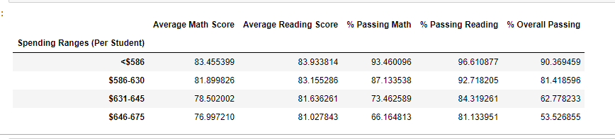 
              
####      c. Scores by school size
              There is a fractional change to the Medium School Size bucket of data however after we apply the formating to the dataframe it will be unnotiable.
   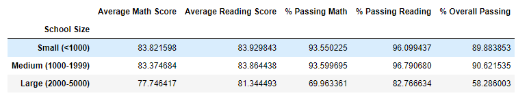
   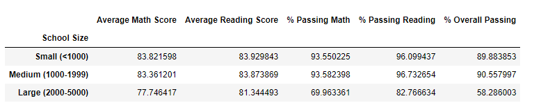 

####      d. Scores by school type
              There is a fractional change to the Charter School Type bucket of data however after we apply the formating to the dataframe it will be unnotiable.
   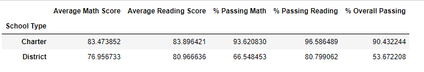
   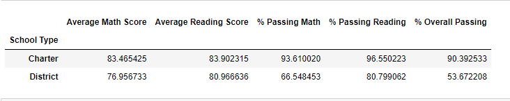 

## Summary
    
